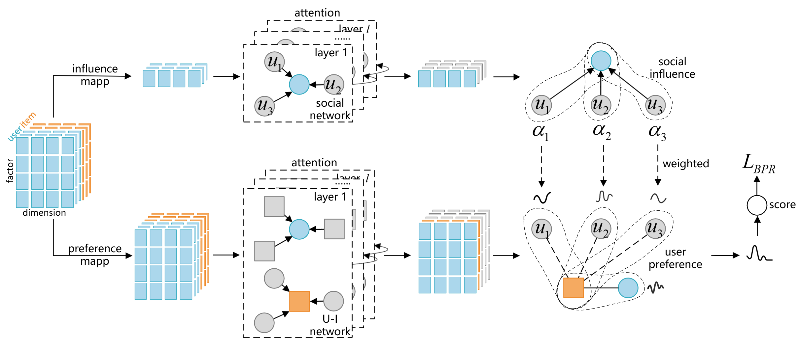

 # Social Influence-weighted User Preference: A New Perspective for Social Recommendation

**The implementation code will be released after the acceptance of the paper.**

This is the PyTorch implementation for **SIUP** proposed in the paper **Social Influence-weighted User Preference: A New Perspective for Social Recommendation**.

> Gang-Feng Ma, Xu-Hua Yang*, Xilin Wen, Haixia Long, Yanbo Zhou. 2024.

 

## 2. Running environment

We develop our codes in the following environment:

- python==3.7.10
- numpy==1.19.2
- pandas==1.12.3
- scipy==1.6.0
- tqdm==4.59.0
- torch==1.8.1

## 3. Datasets

| Dataset  | # Users | # Items | # Interactions | # Social Ties |
| :------: | :-----: |:-------:|:--------------:|:-------------:|
|   Ciao   |  1,925  | 1,5053  |     23,223     |    65,084     |
| Epinions | 14,680  | 233,261 |    447,312     |    632,144    |
|   Yelp   |  99,262 | 105,142 |    672,513     |   1,298,522   |
